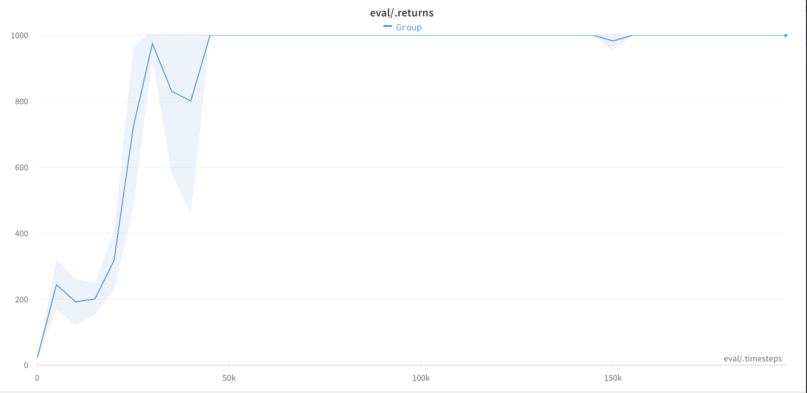

# SAC
PyTorch implementation of Soft Actor Critic (SAC)

SAC is an off-policy actor critic reinforcement learning algorithm based on entropy maximisation.

[Paper available here](https://arxiv.org/abs/1801.01290)

#### Performance 
Tested with PyBullet envs

*HalfCheetahBulletEnv*

*InvertedPendulumBulletEnv*
